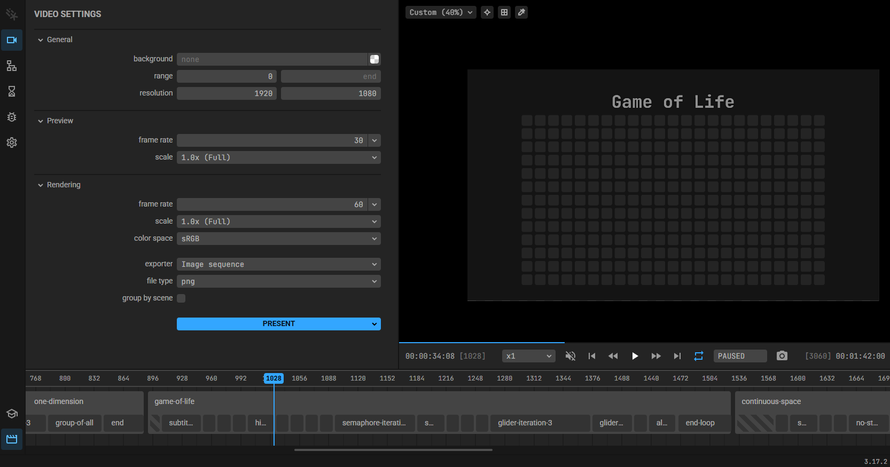

+++
title = "A Continuous Game of Life (a PWL talk)"
authors = ["Jack"]
date = 2025-06-19
slug = "pwl_a_continuous_game_of_life"
draft = true

[taxonomies]
tags = [ "coding", "PWL"] 

[extra]
preview_image = "thumbnail.jpg"
excerpt = "My first talk ever. A few people laughed, but in the good way."
+++

Papers We Love is an international community focusing on finding and sharing cool scientific papers and tech articles with your peers. It has chapters all across the globe, include one in Milan, where I am living.


*To be fair, the PWL homepage is not really up to date.*

Captained by [Edoardo Vacchi](evacchi.dev), the Milan Chapter has been active for a few years, mostly bringing experts to talk about what they are experts in, and it’s been a blast so far (although victim of the recent AI infatuation, like everything else).

Recently, they put out a call for lightning talk topics - the idea was to have 3 shorter talks in an evening, covering different topics and buffering in case of last-minute defections or other unexpected events. This is a short summary of my talk, which happened on May 2025.

# The Presentation

With a limit of 15 minutes, the visual impact of the presentation is important. Each slide deserves a unique design, meant to send a message as effectively as possible. Video channels like [MinuteEarth](https://www.youtube.com/user/minuteearth) and [xkcd's What If?](https://www.youtube.com/@xkcd_whatif) come to mind - even though it's quite an ambitious bar to set.

## Motion Canvas

Since I clearly was already ambitious, I set myself to make the presentation using [Motion Canvas](https://motioncanvas.io/), a TypeScript library written by [aarthificial](https://www.youtube.com/@aarthificial) for his own Youtube videos (which I highly recommend). The library has a presentation mode, which is not its main use-case but adapts the system of syncing with voiceovers with the “next slide” command of a presentation. It is fully procedural, it allows to fine-tune a lot of its graphic effects and actual simulations, to the point of running GPU shaders ON the slide - which is what attracted me on the first place.


*...a LOT of code.*

It’s… a powerful tool, but the amount of boilerplate code can be daunting. 

I have no shame confessing I made heavy use of Cursor (with Claude 4) to generate most of the code - manually writing the logical bits and the frequent spots where Claude would just allucinate in circles.

The fully runnable code of the presentation is [available on Github](https://github.com/thelazyone/pwl_lenia_presentation), but the code itself is clearly not the point. It quite literally just requires `npm` with `three`, then running it with
```
npm install
npm start
```

And you'll find your presentation ready to go!



If you have a video you want an animation for, or if you _really_ have time to waste on a talk as apparently I did, it's a great tool to have on your belt.


# A Cool Paper (or Two)

I tend to have a Notion document with a whole bunch of fun articles and papers collected over the years: I get easily distracted, and a **mind garden** is precious. The first article about an implementation of a cellular automata in a continuous space I found went right there. It was the perfect candidate for a lightning talk!

Turns out there are many implementations, each with its perks and flaws. But let's hold our horses for a moment more.

## Game of Life

I'm somehow assuming that everyone landing here is familiar with [Conway's Game of Life](https://en.wikipedia.org/wiki/Conway%27s_Game_of_Life), but among the audience in the talk there were some who never spent an evening or two playing around with gliders and puffers.

In short: GoL is a set of rules applied to an infinite 2D grid, in which each cell can either be alive (1) or dead (0). Starting with any random pattern, every iteration of the universe each cell counts the neigbours that are alive.


Just like that, you have all kidn of patterns, including repeating and moving structures, like this one:


*credit: Wikipedia and [Bill Gosper](https://en.wikipedia.org/wiki/Bill_Gosper)*

People have talked in any way possible about GoL, but the main takeaway is that it's (nearly) useless and (very) cool. To me, it shows how you can describe a whole universe with a handful of rules, and that, possibly, zooming back enough you could sense patterns complex enough to compete with the way modern physics traumatized whole generations of young physicists.

## Moving into the Continuous

There are a few ways to _imagine_ how something like this would work in a continuous space, but the way I found easier to explain is through several steps: Game of Life works on a discrete space with discrete states and dynamics, interacting only with neighbouring cells at fixed time intervals.


First, let's extend the area of interaction:


At this point, it makes sense to have different weight for different distances from the centre.


Nothing stops me from extending the area, adapting the parameters to keep a similar pattern with progressively smaller cells, and shorter time intervals...


Until eventually we end up with a continuous pattern.


With this in mind, Let's look at the implementations.

## Smoothlife

[(Link to the paper)](https://arxiv.org/abs/1111.1567)

Smoothlife might possibly be the first to come out, back in the early 2000s, and in a way it's the one that most closely resembles Game of Life.
The way they do so is by treating each point

Here a real 

## Lenia

