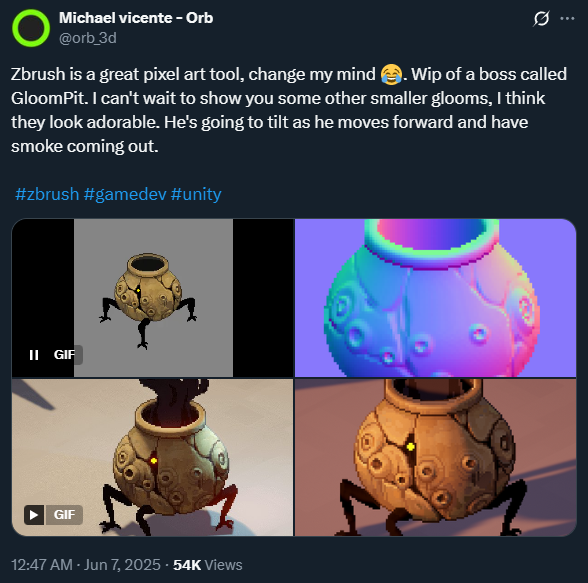
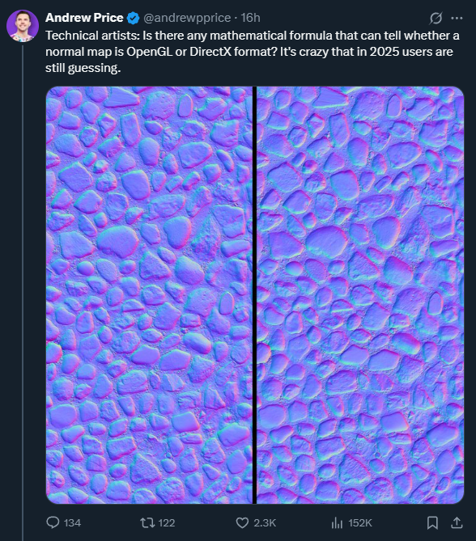
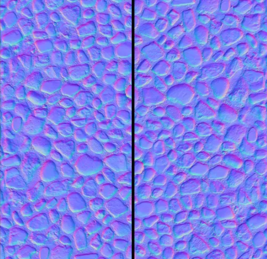
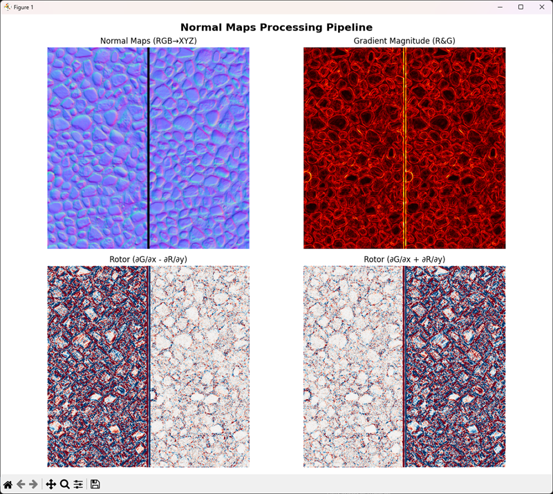
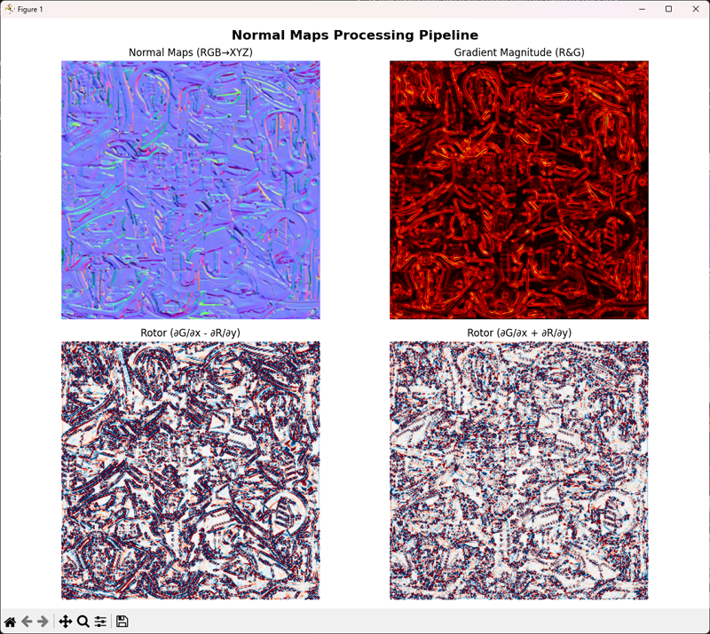
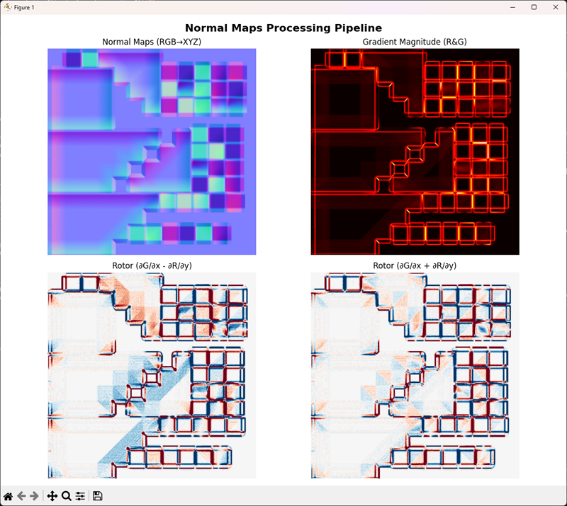
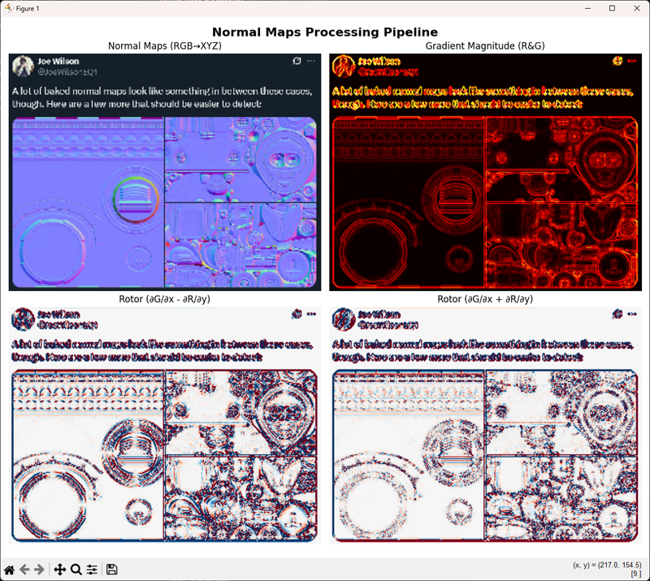
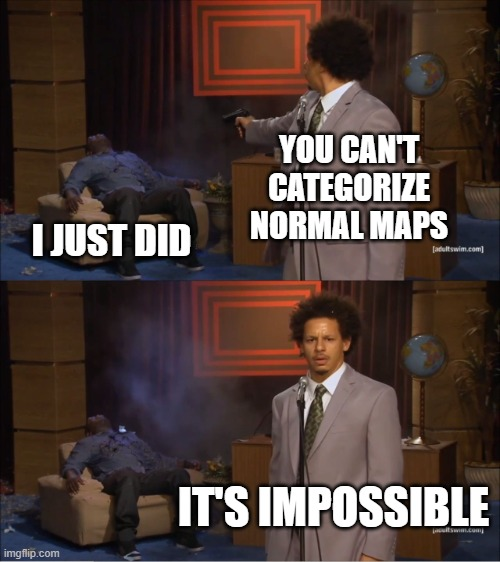

+++
title = "Two Kinds of Normal"
authors = ["Jack"]
date = 2025-06-19
slug = "two_kinds_of_normal"
[taxonomies]
tags = [ "coding", "3D", "Graphics" ] 
+++

Apparently the world of 3D graphics is split in two: right-handed and left-handed normal maps. And it really looks like people can’t find an easy way to discern which is which. 

Within the limits of a non-perfect solution, I kind of did.

## What’s a Normal Map?

let’s start with the basics, in a very simple way.

Among the render information you want to have on an object in a 3D space, there’s a nice way to add more details on a mesh by defining arbitrarily, for each point, a certain direction the surface is pointing at. This means that there is more information for environmental lighting to reflect and bounce off, and that alone makes normal maps possibly the most important source of information you can give to a mesh, after its colours.

In a practical sense, the normal map is just another texture, which stores for each pixel its direction on X Y Z, translated in the R G B channels: each channel is converted from [0.0, 255.0] into [-1.0, 1.0]. 

*[(Link to the original tweet)](https://x.com/orb_3d/status/1931120894048358781)*

A great example of this comes from Michael Vincente - you can see each pixel’s behaviour with a moving light. It works just the same of a UV Map, it’s just a bit easier to follow with the eyes. :)

When the surface is flat, the pixel is of a light blue (128, 128, 255). If a detail is pointing on the right you get an orange-red hue, and so forth. A bulge on a flat surface will have an halo of colors, shifting from red to blue, to green to yellow... Or does it?

## About Chirality

Turns out not. Depending on whether the normal map was made for OpenGL or DirectX, the value of the Y gets inverted.

Now, apparently the two shaders went for  equally valid ways of declaring the coordinates of space. In fact, keeping the three coordinates orthogonal there’s **only two** ways to define the space. Because of our funny primate hands, we’re calling these coordinate systems as right-handed and left-handed.

*Credits to [FreyaHolmer](https://x.com/FreyaHolmer) for the chart*

Doesn’t matter how much you try, but as long as you rotate or translate a left hand you’ll never end up with a right hand (it’s ok, you can try) - the only way to get there is to **mirror** the hand, or the space around it.

This dualism under which you can order objects in a way that is consistent for rotations and translations but not symmetry is called Chirality, and is a big deal in many fields, from Particle Physics to Chemistry. Some simple compounds could be having a nice smell in one of the two configurations, or the effects can be far more dramatic, [such as the case of the Thalidomide](https://en.wikipedia.org/wiki/Thalidomide).

## The Real-world Problem

It all started a while ago, when Andrew Price (an internet personality, founder of [Blenderguru](https://www.youtube.com/@blenderguru), among other things) put out an interesting challenge-slash-rant: nobody seemed to have an easy way to discern the left-handed and the right-handed normal maps!

As of now there are about 200 comments between here and on some reposted links, and everyone is either saying “it can’t be done with math”, or “just use your eyes”, or “just use AI”.

And indeed expert people **COULD** spot it right away with their eyes, but not for the right reason: While often true, Deciding based on the assumption that in most OpenGL solutions “the light comes from the top” is just not a good criterion, because if the same texture was representing craters instead of rocks, the light (which is indeed just the area where the RG component is closer to 1,1) would be on the bottom. 

Simply rotate the normal map of the OpenGL version 180°, and you end up with holes where the rocks are: The two maps look now very similar, yet one is for DirectX, one for OpenGL:

*Good luck eyeballing this.*

The easy way to solve it is gone - if a solution must work for all kinds of textures (or for the vast majority of them), it should easily handle this case. 

## Closed Loops and Curls

That’s where Chirality comes into play, as long as you follow the edge of any change in elevation, clockwise:

- On the left side: purple → blue → green → white
- On the right side: purple → white → green → blue

Interestingly, this is true BOTH for holes and for bumps.

A layman solution would be to follow the borders of such areas, and check which colour follows “purple” - but it’s such a complex task that I wouldn’t really want to touch it with a three-foot poles.

What about a whole bunch of generic loops? What gives us any certainty that it would go right? It actually might, but again, it’s dirty.

Luckily, Math can come to our help. Just like Gradients act as a local differential of an image with itself - or in simpler terms “every point is the difference between the point and the surrounding ones” - we can calculate the gradients around any loop, including infinitesimally small ones.  ([That is a Curl, or Rotor.](https://en.wikipedia.org/wiki/Curl_(mathematics)) )

Now, aside from the magic math, Curls can be derived by the partial gradients, and the formula is fairly simple:

**curl F = ∂Q/∂x - ∂P/∂y**

**Where:**
* P and Q are the components of the vector field F in the x and y directions, respectively.
* ∂Q/∂x represents the partial derivative of Q with respect to x.
* ∂P/∂y represents the partial derivative of P with respect to y.

Implementing it via code is even simpler.

## Results

The script… simply worked right away. 

The main point to see is that the cursor has a deeply different behaviour in one case and the other (left), and inverting the y (therefore switching the sign in the cursor formula) the behaviour is swapped neatly. Aside from the technicalities behind, we have what we want: A way to discriminate which kind of normal this is! 

Knowing that the left normal map is OpenGL and the right one is Direct X, we will expect GL maps to have a heavier result with the normal Curl, and a lighter value with the inverted Curl, like the one below:

With the help of [Joe Wilson](https://x.com/JoeWilsonEQ1) I put the logic under stress - starting with [the Cube of Hell](https://x.com/JoeWilsonEQ1/status/1935456296225972477):

And some other random texture. I included the tweet as well, because why not.

All the cases above are OpenGL, but the difference is more than noticeable. Even more, flipping the image and running a diff between the two should make it a lot more evident.

## Limits and Developments

There is a LOT of improvements that can be done on the processing to better differenciate the two families of normal maps, and here I will mention a few.

### Resolution

The problem of Curls is that they are local: no information outside of the surrounding pixels is kept in the logic, and this is a limiting factor when working with arbitrary normal maps.

I personally downscaled all the maps to 320 pixels, so that each curl would indeed interest an area roughly 3 times wider --- but changing the resolution is possible to spot different curl values at different scales. 

This is not how Curls should be used in real life, but it could definitely allow for a "multimodal" approach for a smarter recognition of the normal differences.

### Dual Difference

The whole setup is inherently symmetrical: since the normal map itself is just flipped along Y, you can analyze a normal map against itself flipped, and apply the rotor once on both (rather than both rotors). It's an obvious statement, but it's still worth pointing out.

### Limit Cases

The core assumption of this solution is that saddles (flat areas whose surrounding are partially protruding and partially recessing) are FAR more rare than bumps and holes. This is not true for certain kind of patterns (chainmails) and for random noise. In such cases there's not much to do, other than hoping that there is a displacement/relief map available as well.

Needless to say, if that is the case the solution to the whole problem is however trivial, so any implementation should probably look for the relief map beforehand, and perform a much quicker check on the two, falling back to the present solution otherwise.

## A Little Rant

It's worth adding a small note about how frustrating social media can be sometimes: I replied relatively soon to the original post from Andrew Price, but at that time there were already 120 messages before mine. Not matter how much I tried, he never saw my post.

This is frustrating for me, because I had something cool (simple, but cool) to show, and nobody would listen. But it's frustrating for anyone asking for help as well - they will likely never read the answer that someone might have.

To add to the frustration, Blendere Meme soon shared the OP on Facebook. Same process, same level of visibility, near zero.

So… what now? Of course to automate this there’s several steps to follow, but until someone with a proper use case finds this post, I’d say I’m gonna let it rest, waiting for a better day.

### EDIT: A few hours later

Turns out sending multiple messages works against the Algo - Some people started tagging the OP as well, and a reply arrived.

I have found a new hope for humanity, and possibly some more fun challenges ahead!

~Jack